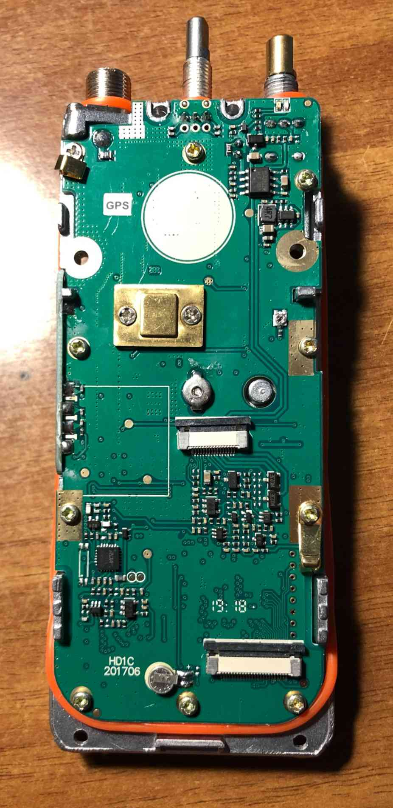
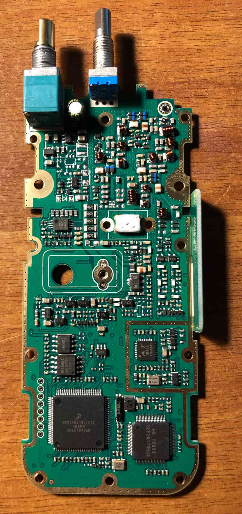

# Ailunce HD1

## Specifications

* MCU: NXP MK22FN512VLL12
* Baseband: Hongrui HR_C6000
* Display: 160x128 color TFT
* Frequency ranges
    * VHF: 136.0000-174.0000
    * UHF: 400.0000-480.0000

## Hardware Configuration

The Ailunce HD1 is very similar to the Radioddity GD77 in its hardware
configuration, schematics for this radio are public domain
and [can be accessed here](https://github.com/OpenRTX/OpenRTX-external-docs/raw/main/Schematics/Ailunce_HD1_schematic.pdf).

## Flashing

Support for flashing the Ailunce HD1 is implemented in [this `radio_tool` fork](https://github.com/n1zzo/radio_tool), to be merged upstream.
You can flash a raw binary as produced by objcopy, the bootloader will write it at offset `0x4000`.

## Memory Mapping

|            Name          | Start Address | Length     |
|:------------------------:|---------------|------------|
| Internal Flash           | 0x0           | 0x00080000 |
| FlexBus                  | 0x08000000    | 0x08000000 |
| SRAM                     | 0x1C000000    | 0x04100000 |
| Program Flash (CPU only) | 0x30000000    | 0x04000000 |

## Pin Mapping

|Pin|GPIO|Schematic Net|
|---|---|---|
|1|PTE0|GPS3V3_EN|
|2|PTE1|DMR_SLEEP|
|3|PTE2|PTT|
|4|PTE3|DMR_CS|
|5|PTE4|SPI_SCLK|
|6|PTE5|SPI_MOSI|
|7|PTE6|SPI_MISO|
|14|ADC0_DP1|VOTAGE|
|18|ADC1_DP3|VOX|
|27|DAC0_OUT|RF_APC|
|31|PTE24|PRA|
|32|PTE25|VOICE_DATA|
|33|PTE26|VOICE_CLK|
|34|PTA0|SWCLK|
|35|PTA1|UART_RX|
|36|PTA2|UART_TX|
|37|PTA3|SWDIO
|38|PTA4|EZP_CS|
|39|PTA5|P_U/V|
|42|PTA12|I2S_RX|
|43|PTA13|KEYSTOKE1|
|44|PTA14|I2S_CK|
|45|PTA15|I2S_TX|
|46|PTA16|I2S_FS|
|47|PTA17|RF_ANT_SW|
|50|PTA18|ARM_CLK|
|53|PTB0|RING/1750HZ|
|54|PTB1|KLED/BLED|
|55|PTB2|I2C_SCL|
|56|PTB3|I2C_SDA|
|57|PTB9|CON|
|58|PTB10|V_CS|
|59|PTB11|V_SCLK|
|62|PTB16|V_SDI|
|63|PTB17|V_SDO|
|64|PTB18|GREEN_LED|
|65|PTB19|RED_LED|
|66|PTB20|FREQ1|
|67|PTB21|FREQ2|
|68|PTB22|FREQ3|
|69|PTB23|FREQ4|
|70|PTC0|MUTE1|
|71|PTC1|RF_TX_EN|
|72|PTC2|RF_RX_EN|
|73|PTC3|SPK_SHTD|
|76|PTC4|FLASH_CS|
|77|PTC5|FLASH_CLK|
|78|PTC6|FLASH_DI|
|79|PTC7|FLASH_DO|
|80|PTC8|PWR_INT|
|81|PTC09|PWR_CTRL|
|82|PTC10|LCD_CS|
|83|PTC11|LCD_WR|
|84|PTC12|LCD_RST|
|85|PTC13|LCD_RS|
|86|PTC14|LCD_RD|
|87|PTC15|DMR_RX_INT|
|90|PTC16|DMR_TX_INT|
|91|PTC17|DMR_SYS_INT|
|92|PTC18|DMR_SLOT_INT|
|93|PTD0|LCD_D0/KIN0|
|94|PTD1|LCD_D1/KIN1|
|95|PTD2|LCD_D2/KIN2|
|96|PTD3|LCD_D3/KIN3|
|97|PTD4|LCD_D4/KOUT0|
|98|PTD5|LCD_D5/KOUT1|
|99|PTD6|LCD_D6/KOUT2|
|100|PTD7|LCD_D7/KOUT3|

## M17 Path

- MCU to RF:
    1) Generation of baseband signal via PWM modulator on pin 53 (RING/1750Hz) -> same mechanism of MD380
    2) Remove C51 and C389 to extend the signal bandwidth towards the AT1846S (probably not needed, testing required)

- RF to MCU:
    1) Connect pin 1 of U104 either to MCU pin 16 or pin 20 (ADC inputs) for sampling of incoming baseband signal, after amplification stage   
    2) Remove C370? -> extend bandwidth of incoming signal down to DC level, should have no impact on DMR

- Mic to MCU:    
    1) Usage of VOX signal    
    2) Remove C356, Q309, C355 -> removal of peak detector circuit, as in MD380    
    3) Keep R363 and add 100k resistor towards 3v3 -> add DC bias of VDD/2 to mic signal

- MCU to spk:
    1) Use HR_C6000 sound playback functionality, it should not be painful.

## Hardware Version Discovery

On startup the application image calls a function at 0x3000 with its model
string, which triggers a reset if it doesn't match. the models are either
`IHDHD1GPS` for the GPS model, or `IHDUV8580` for the non-GPS model

## Disassembly

TODO

## dmesg

USB cable is a serial adaptor, this log appears even without radio.

```
[ 5546.159081] usb 1-1: USB disconnect, device number 14
[ 5546.159387] pl2303 ttyUSB0: pl2303 converter now disconnected from ttyUSB0
[ 5546.159423] pl2303 1-1:1.0: device disconnected
[ 5547.298284] usb 1-1: new full-speed USB device number 15 using xhci_hcd
[ 5547.439883] usb 1-1: New USB device found, idVendor=067b, idProduct=2303, bcdDevice= 3.00
[ 5547.439896] usb 1-1: New USB device strings: Mfr=1, Product=2, SerialNumber=0
[ 5547.439902] usb 1-1: Product: USB-Serial Controller
[ 5547.439906] usb 1-1: Manufacturer: Prolific Technology Inc.
[ 5547.441501] pl2303 1-1:1.0: pl2303 converter detected
[ 5547.442577] usb 1-1: pl2303 converter now attached to ttyUSB0
```

## Debug Pads

| #Pad | MK22 Pin | Schematic Pin |
|:-----|----------|---------------|
| 1    | RESET_b  | ARM_RST       |
| 2    | USB0_DM  | USB0_DM       |
| 3    | USB0_DP  | USB0_DP       |
| 4    | SWD_CLK  | SWCLK         |
| 5    | EZP_CS_b | EZP_CS        |
| 6    | GND      | GND           |
| 7    | 3v3      | 3v3           |
| 8    | SWD_IO   | SWDIO         |


## CHORD U306

This chip is the voice synthesize from the baofeng radio

86 -> "Channel Mode"  
85 -> "Frequency Mode"  
60 -> "Zero"  
62 -> "Two"  
...  
69 -> "Nine"  
?  -> "Cancel"  

## SWD

MK22 is supported by mainline OpenOCD, using `target/kx.cfg`.

## Bootloader

The bootloaded exposes a serial terminal accessible using the programming cable.
The serial port uses a 57600 baud rate.

This is the prompt shown by the bootloader:

```
========================== Main Menu =====================

= (C) COPYRIGHT 2015 XiaMen Sloan Electronic Technology CO.,LTD

= Press 1 to Update application

= Press 2 to View Version

= Press 3 to Execute program

==========================================================
```

If 1 is pressed the radio listens for a firmware upgrade.
If 2 is pressed the prompt is shown.
If 3 is pressed the main firmware is booted.

After a successful upgrade this screen is printed:

```
 Programming Completed Successfully!
--------------------------------
 Name: HD-HD1A-V1.7.7-GPS.bin
 Size: 397313     Bytes
-------------------
```

The firmware is sent in wrapped form.

To dump the firmware sent from the updater to the radio:
```
socat /dev/ttyUSB0,b57600,raw,echo=0 \
SYSTEM:'tee in.txt |socat - "PTY,link=/tmp/ttyV0,b57600,raw,echo=0,waitslave" |tee out.txt'
```

The bootloader uses the [ymodem protocol](http://www.blunk-electronic.de/train-z/pdf/xymodem.pdf).

## Pictures

### Radio Cover


### PCB Front



### PCB Back



## References

- [MCU (NXP MK22FN512VLL12) Product Page](https://www.nxp.com/part/MK22FN512VLL12#/)
