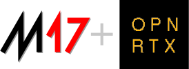
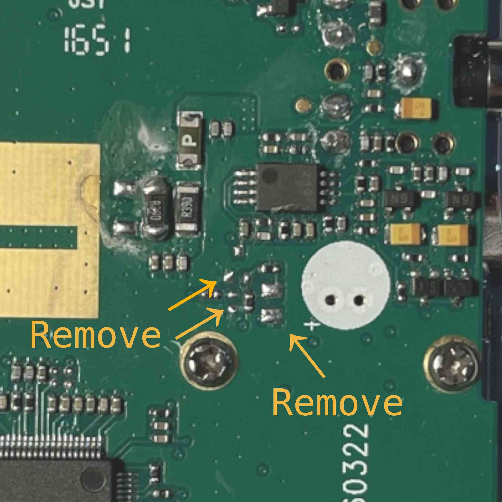

M17 is a new digital radio protocol in development as an alternative to those currently available, with freedom in mind. Freedom in the code, protocol, voice codecs, and hardware. The goal is to provide a better option for digital radios in the future.

The OpenRTX team is collaborating with M17 team to bring M17 protocol support to OpenRTX radios.

We want to make digital voice experimentation accessible on commodity hardware.

Follow the experimentation progress on the [M17 Twitter Account](https://twitter.com/m17_project).

## M17 on the MD-380

We are bringing experimental M17 support to the TYT MD-380 DMR radio. However, due to technical limitations of the underlying hardware, transmitting M17 audio on the radio requires a small hardware modification.

The modification enables the MCU on the radio to directly access the audio signal coming from the microphone, bypassing the HR_C5000 normally used to sample microphone input.
We cannot use the HR_C5000 DACs, because those can be accessed only in DMR mode, and we are leveraging HR_C5000 analog FM mode to transmit M17 data.

The MD-380 already has access to the microphone input, this is used for the VOX function in the original firmware, however this input is heavily filtered, which results in an analog bandwidth which is too narrow to be used for voice input.

We alter the analog filtering of the VOX input. The modification itself is quite small, we need to remove the EC151 capacitor and to bridge the top and right pins of the D102 diode.

This is the logic board of the TYT MD-380:

We are going to remove EC151 and bridge D102, this is a picture of the two components before the modification:

After the modification:

This modification has a minor impact on the VOX functionality on any firmware different than OpenRTX. The VOX level 1 will be always open, higher VOX levels still work as expected. When VOX functionality will be implemented on OpenRTX, we'll take care to support both modified and unmodified MD-380 radios.
