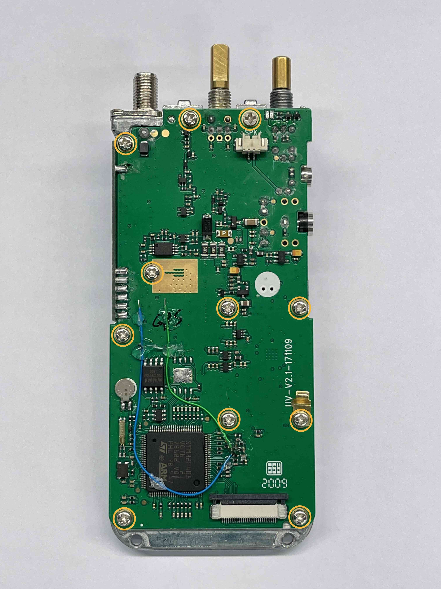

## M17 on the MD-UV380
The Tytera MD-UV380 uses a HR_C6000 DMR baseband, that cannot be repurposed to run M17.
M17 can be encoded and decoded by using the radio MCU, to do so we need to ensure to have the
necessary audio paths between MCU, RF part, speaker and microphone.

There are two audio paths that require some hardware modifications:
- MCU → Spk: Available
- MCU → RF: Available
- Mic → MCU: Requires hardware mod
- RF → MCU: Requires hardware mod

### Equipment required
To perform the Mic → MCU and RF → MCU mods you need:
- Screwdrivers: Torx T6, Torx T8, Philips #0
- Plastic spudger like [this](https://it.aliexpress.com/item/32834353313.html) or similar
- 1x 200KΩ THT (through-hole) resistor with at least 1% tolerance and 1/8W rating
  ([example](https://it.rs-online.com/web/p/resistori-montaggio-a-foro-passante/0149054/))
- some 30AWG Kynar wire
- A small tip soldering iron
- A desoldering pump or solder wick
- (optional but recommended) 20x stereoscope like [this](https://www.amazon.it/BRESSER-8852000-Stereomicroscopio-Bresser-Junior/dp/B001UJJGV4)
- (optional but recommended) Hot glue gun to glue wires to PCB

### Disassembling the radio
- Remove the battery and the antenna
- Remove the belt clip if present
- Pull out the volume and channel knobs to remove them
- Unscrew the three nuts around the antenna connector, volume and channel knobs using a pair of
  pliers
- Unscrew the two upper screws (Torx T8) on the back and remove the plastic part they hold
- Unscrew the two lower screws (Torx T8) on the back
- Use the spudger to remove the bottom part of the aluminum heat-sink from the outer case
- Be careful when separating the heat sink from the outer case, the two are joined by the display
  flat cable and the speaker wires, which you should remove first.
- At this point you should have the internal radio assembly separated from the case\
(Ignore the green and blue wires, they were used to sniff the AT1846S I2C bus)\

### Accessing the RF side PCB
Both mods (Mic → MCU and RF → MCU) require accessing the RF side of the PCB, 
the one which faces the heat sink.

- Remove the 11 Philips #0 screws from the logic side of the PCB \

- Remove the 2 Torx T6 screws from the side button PCB \

- Desolder the antenna connector as shown in the picture \
The antenna connector is fixed to the heat sink with two screws,
removing them should NOT be necessary to perform the mod

### Mic → MCU
This modification is similar to the one required on the MD380, with the exception that the circuit
to modify is on the RF of the PCB, the RF side can be accessed only by desoldering the antenna
conntector.
### RF → MCU
TODO
