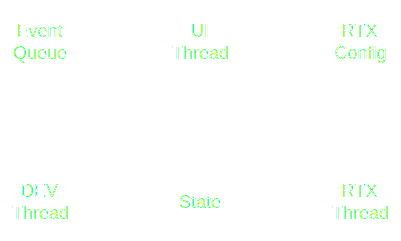

# OpenRTX

OpenRTX software architecture documentation

## Threading Model
OpenRTX employs a **multi-threaded** architecture. \
This allows to handle different concurrent operations while keeping the code complexity low, 
because every self-contained operation is performed by a different thread.

The current implementation uses 5 threads:
- **UI Thread**: Draws the User Interface and handles button behaviour
- **DEV Thread**: Checks device parameters (e.g. battery voltage) at a slow interval
- **KBD Thread**: Read the keyboard status and sends keyboard events to the UI Thread
- **RTX Thread**: Handles the RF part and executes requests of the UI Thread
- **GPS Thread**: Provides current position when GPS is enabled

The OpenRTX threads communicate between them by using _event queues_ and _shared state_ data structures.

This diagram shows the interaction between threads, queues and shared states.



Some OpenRTX threads are _event-based_, other are executed at _regular intervals_, see the
following table for details

|Thread|Interval   |Event         |
|:-----|:----------|:-------------|
|UI    |-          |KBD and DEV   |
|DEV   |1Hz  (1s)  |-             |
|KBD   |20Hz (50ms)|-             |
|RTX   |33Hz (30ms)|-             |
|GPS   |-          |NMEA sentence |

## Interfaces

## UI Finite State Machine

## Code guidelines and notes
### General considerations about thread safety
By design, low level drivers (display, keyboard, ...) are **not** written to be thread-safe: concurrent access to hardware resources has to be managed by the upper level modules (e.g. graphics driver has to take care of concurrent access to display). Moving the burden of guaranteeing thread safety to high level modules simplifies the software development process, since code for thread safe operation has to be designed, written and tested only once and for all. Porting to a new platform, then, is only matter of writing functioning (and optimised) code for low level drivers.

In any case, the low level drivers provide a means to determine if the controlled device is busy, thus allowing for concurrent access management. As said above, since the low level drivers are **not** thread safe, these functions should be preceded by ```CPU_CRITICAL_ENTER()``` and followed by ```CPU_CRITICAL_EXIT()```, which are the uC/OS-III macros for critical section management. As an example, let consider the display driver's function to check if rendering is in progress:

```C

[...]

bool inProgress = false;

CPU_CRITICAL_ENTER();
inProgress = display_renderingInProgress();
CPU_CRITICAL_EXIT();

[...]

```

### Target-specific programming notes
#### MD-380 and MD-UV380
* Keyboard and display share some data lines, thus ```kbd_getKeys()``` **must not** be called simultaneously with ```display_renderRows() ``` or ```display_render() ```. The display driver provides a function which allows to check if rendering is in progress while, for the keyboard one, the fact that the I/O lines are taken busy by the driver is implicit in having the execution flow inside ```kbd_getKeys() ```.
* Display framebuffer should not be written while a rendering is in progress. Framebuffer is copied to the screen through DMA and it has been observed that, if the buffer is written while a DMA transfer is in progress, following calls to ```display_renderRows() ``` or ```display_render() ``` may have no effect, due to having DMA screwed up in a wrong state.
* Content of display framebuffer is changed inside ```display_renderRows() ``` or ```display_render() ```. Since the display controller needs to be provided with pixel data in big endian order, while the MCU is little endian, inside the two render functions the whole content of the framebuffer is byte-swapped to accomodate for the endianness of the display controller. As a consequence, writing a pixel and then reading it back returns the written value **as long as** ```display_renderRows() ``` **or** ```display_render() ``` **are not called**.

#### MD-380
* SKY73210 and HR_C5000 share part of the SPI bus. SKY73210 provides ```SKY73210_spiInUse()``` function to allow high level modules determine if SPI bus is taken by PLL driver or not.

## Dependencies between modules
